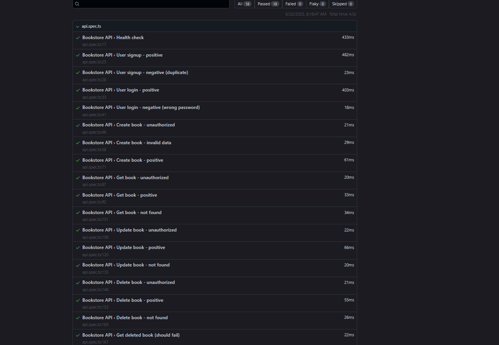

# Bookstore API Automation

## Overview

This project provides an automated API test suite for the Bookstore FastAPI application using Playwright and TypeScript.

---

## How to Run the Test Suite

1. **Install Python dependencies for the FastAPI app**

   ```bash
   pip install -r bookstore/bookstore/requirements.txt
   ```

2. **Start the FastAPI server**

   ```bash
   cd bookstore/bookstore
   uvicorn main:app --reload --host 0.0.0.0 --port 8000
   ```

   _(Or use `python -m uvicorn main:app --reload --host 0.0.0.0 --port 8000` if `uvicorn` is not in your PATH.)_

3. **Install Node.js dependencies for the test suite**

   ```bash
   cd ../tests
   npm install
   ```

4. **Run the Playwright API tests**

   ```bash
   npm test
   ```

5. **View the HTML test report**
   ```bash
   npm run test:report
   ```
   The report will open in your browser.

---

## Testing Strategy

- **Coverage:**  
  All major API endpoints are covered, including authentication (signup/login) and CRUD operations for books.
- **Positive & Negative Scenarios:**  
  Tests include both valid and invalid requests, unauthorized access, and error handling.
- **Request Chaining:**  
  The output of one API call (e.g., login token) is used as input for subsequent requests (e.g., book creation).
- **Assertions:**  
  Status codes, response payloads, and error messages are asserted for correctness.
- **Configuration:**  
  The API base URL is configurable via the Playwright config file or environment variable.

---

## Reliability & Maintainability

- **Separation of Concerns:**  
  Test code is modular and avoids repetition. Each test is focused and easy to understand.
  Test logic is separated from configuration and data.
- **Scalable Structure:**  
  New tests can be added easily as new endpoints or features are introduced.

---

## Challenges Faced

- **Token Validation:**  
  Ensuring the correct format and handling of JWT tokens between the test suite and FastAPI backend.
- **Data Validation:**  
  Implementing proper request validation in the FastAPI app to handle invalid data and return appropriate error codes.
- **Environment Consistency:**  
  Making sure the FastAPI server is running and accessible before executing tests.

---

## Sample Test Report

After running the test suite, you can view a detailed HTML report.  
Below is a screenshot example:



Or, open the generated HTML report in your browser after running:

```bash
npm run test:report
```

---

## Additional Notes

- Ensure the FastAPI server is running at `http://localhost:8000` before running the tests.
- All test dependencies are listed in `tests/package.json`.
- For any issues, check the FastAPI server logs for error details.

---
